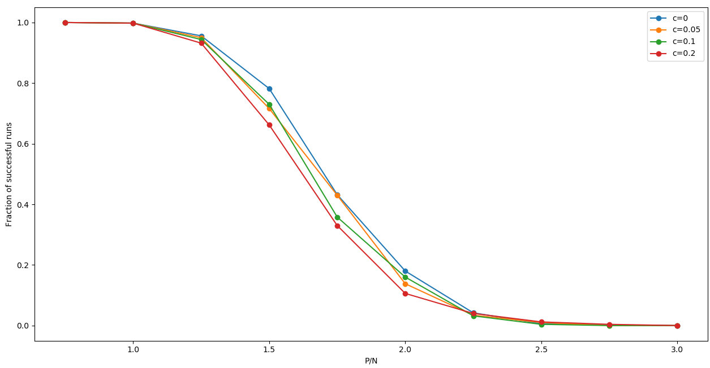

# Rosenblatt Perceptron Training

## Abstract
The Perceptron can be described as the foundation to Artificial Neural Networks as we know it today. It was particularly popular in the 60s when it was proven to always converge to a solution if it exists, for a linearly separable dataset. This project utilizes this convergence characteristic of the Perceptron to describe the relationship between the linear separability of a dichotomy and the ratio () of the population size to the number of features. It was observed that for , the probability that a dataset is linearly separable decreases with increasing values of . It was also observed that for a large number of features, this relation became more steep and gets close to a step function as predicted by a theorem. The results also showed that the threshold c for label classification by the Perceptron does not truly affect the classification performance of the perceptron. It further showed that using a clamped input for the Perceptron in order to find solutions for inhomogeneous linearly separable datasets slightly improved the chance of successful training by the Perceptron on randomly sampled datasets.

## How to run the experiments
- Make sure you have Python 3.7.6 installed
- `python -m pip install --upgrade pip`
- `pip install -r requirements.txt`
- `python Qls_Pls.py`
- `python different_N.py`
- `python different_c.py`
- `python homogeneous.py`

## Parameter Description
 Fraction of successful runs 
 Probability that a dichotomy is linearly separable 
 Number of random populations used to calculate fraction of successful runs 
 Population size 
 Size of feature vector 
Maximum number of epochs for the Perceptron to find a solution 
 P/N 
 Classification threshold (default: > 0)
## Experiment Description
- **Experiment 1**: Comparison of  and 
	This experiment compares the fraction of successful runs of the Perceptron with the probability that a dichotomy is linearly separable. 
Parameters:  
source file: `Qls_Pls.py`

- **Experiment 2**:  Comparison of  different values of N
This experiment compares the effects that different values of N have on . 
Parameters: $0.75\leq\alpha\leq3.0,N=[20,100,200], n_D=50,n_{max}=100$ 
source file: `different_N.py`

- **Experiment 3**: Comparison of different values of c
This experiment compares the effects that different values of c have on . 
Parameters:  
source file: `different_c.py`

- **Experiment 4**: Effect of using a clamped input for the Perceptron
This experiment observes the effects that adding a clamped input (-1) for the Perceptron on the success of the training. It compares this technique to the default used in previous experiments which can not find solutions to inhomogeneous linearly separable dichotomies. 
Parameters:  
source file: `homogeneous.py`

## Results
**Experiment 1**

**Experiment 2**

**Experiment 3**

**Experiment 4**

## Authors
- [Brown Ogum](https://github.com/brown532)
- [Juanjo Guerrero](https://github.com/juanjoguerrero8)

